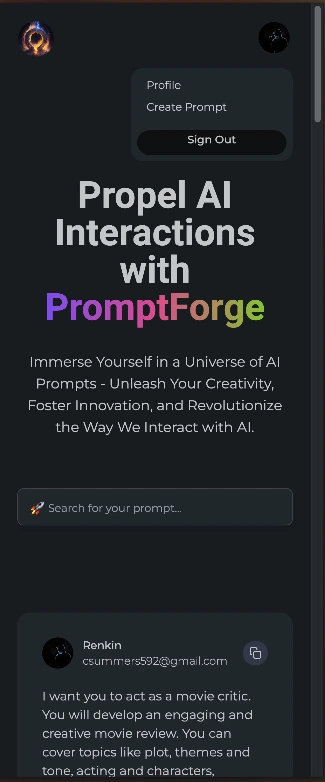
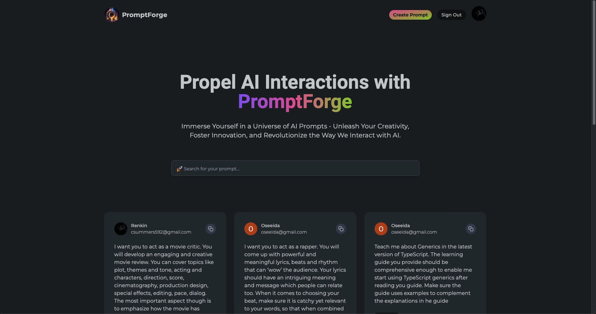

# PromptForge: Your Launchpad to Interstellar AI Adventures 🚀

Hey there! 👋 I'm [Osida Richards](https://www.linkedin.com/in/osida-richards), a skilled full-stack developer and the creator of PromptForge. Feel free to connect with me on [LinkedIn](https://www.linkedin.com/in/osida-richards-780524243/), check out my [portfolio](https://osida-richards-portfolio.vercel.app/) to see my other projects, or explore the code on [GitHub](https://github.com/Osida/PromptForge).

## Preview 👀

## Features 🌌

PromptForge is designed to propel you into an expansive universe of AI prompts. Key features include:

- **Interactive Interface**: Navigating PromptForge is like steering your spaceship through a galaxy full of stars—each star being a unique AI prompt.
- **Responsive Design**: Whether you're using a desktop, laptop, or a handheld device, PromptForge ensures a seamless stargazing experience across all platforms.
- **AI Prompt Aggregation**: Traverse a vast cosmos of AI prompts, with each prompt acting as a launchpad to new and exciting AI endeavors.
- **CRUD Operations**: With Next.js and MongoDB, create, read, update, and delete prompts at your leisure, effectively managing your celestial navigation.
- **Google Authentication**: NextAuth's Google provider ensures a smooth docking process for all space explorers (users).

## Tech Stack 🪐

The gravitational pull holding together the PromptForge galaxy is an impressive stack of tech, including:

- **Next.js**: The warp engine driving the full-stack experience.
- **TypeScript**: The blueprint to our spaceship, providing static types to ensure safe and error-free voyages.
- **NextAuth**: The airlock system facilitating secure user authentication.
- **MongoDB**: The onboard database storing all the necessary coordinates (data).
- **TailwindCSS**: The spaceship's sleek and responsive design framework.

## Work in Progress 🛠️

PromptForge is an ever-evolving project, and I'm continuously working on enhancements and new features to elevate its functionality. Some ongoing developments and future improvements include:

- **User profiles**: Add the ability view other users' profiles and their created prompts
- **Framer motion**: Introduce smooth animations via Framer Motion
- **Server actions**: Incorporation of Server Actions for the forms

Be inspired by the visuals of PromptForge at the [design inspiration](https://dribbble.com/shots/21468735-Brainwave-Landing-UI-Kit-Pricing-Page) page.

## Design Credits 🎨

The cosmic aesthetics of PromptForge were inspired by this stunning [Dribbble design](https://dribbble.com/shots/21468735-Brainwave-Landing-UI-Kit-Pricing-Page). Big shoutout to the original creators!

## Contribution Guidelines 🤝

We welcome contributions from the community to make PromptForge even better. If you have any ideas, bug fixes, or feature implementations, please follow the guidelines below:

1. Fork the repository and create a new branch for your feature or bug fix.
2. Make your changes, ensuring that your code follows the project's coding standards.
3. Test your changes thoroughly.
4. Create a pull request, describing the changes you made and their purpose.

We'll review your pull request as soon as possible and provide feedback if necessary. Your contributions help us create a more powerful and inclusive AI prompt engineering platform!

## Sign Off 🚀

Ready for liftoff? Set course for [PromptForge](https://github.com/Osida/PromptForge) and start exploring the endless possibilities!

And remember, in this vast universe of code, your star can shine too! If you're interested in contributing, feel free to make a pull request or reach out for potential collaborations.

Safe travels, interstellar explorer!

## License Information 📝

PromptForge is licensed under the MIT License. You are free to use, modify, and distribute this project for commercial or non-commercial purposes. See the [LICENSE](https://github.com/Osida/PromptForge/blob/main/LICENSE) file for more details.